# Cómo programar la micro:bit desde una tableta Android (vía Bluetooth)

Vamos a ver cómo podemos programar la micro:bit desde una tableta Android y cómo transferir nuestro programa vía Bluetooth.

## Programamos con MakeCode

Usaremos el editor de bloques [MakeCode](https://makecode.microbit.org/) para crear un sencillo programa desde la tableta

Podemos empezar haciendo que nos muestre un emoji minimalista:

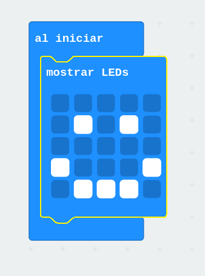

Damos nombre a nuestro programa

Una vez terminado descargamos el fichero hex, pulsando sobre el botón **"Descargar"**

(Escaneando este QR o desde el enlace se puede descargar el programa)

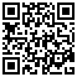 [Programa](https://makecode.microbit.org/_XYw5sE3po5vU)

## App micro:bit

Ahora necesitamos la [app de micro:bit](https://play.google.com/store/apps/details?id=com.samsung.microbit) (creada por Sansumg) para transferir el fichero hex descargado a nuestra micro:bit

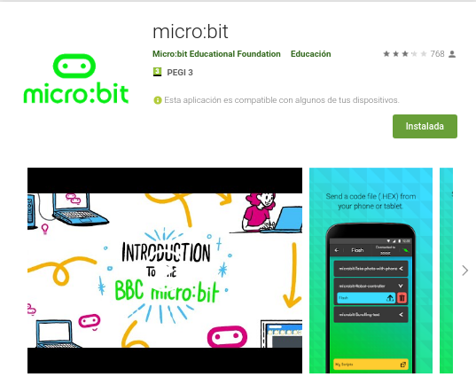

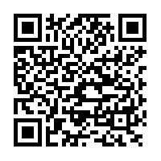[app de micro:bit](https://play.google.com/store/apps/details?id=com.samsung.microbit) 

La instalamos y al abrirla seleccionamos la opción de conectar

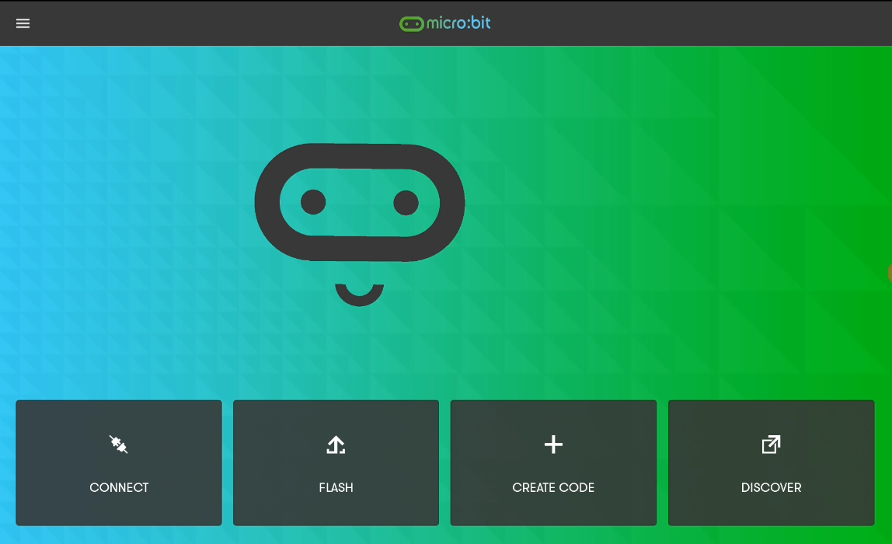

Pulsamos en "Pair a new micro:bit"

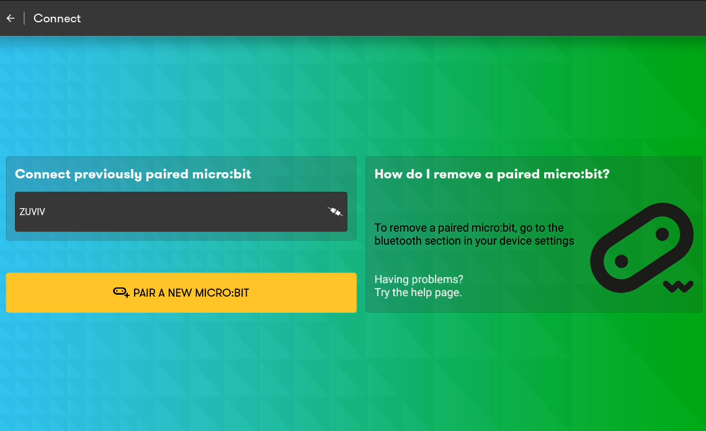

Ahora pulsamos los botones A y B y el de reset, soltamos reset 

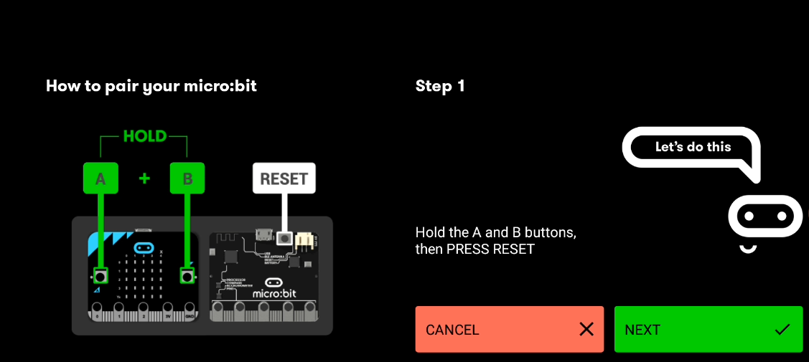

la microbit mientras arranca nos muestra como se llenan los 25 leds sucesivamente 

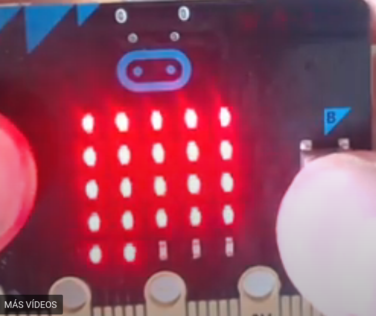

Debe entrar en el modo Bluetooth, mostrando el correspondiente logo en los leds

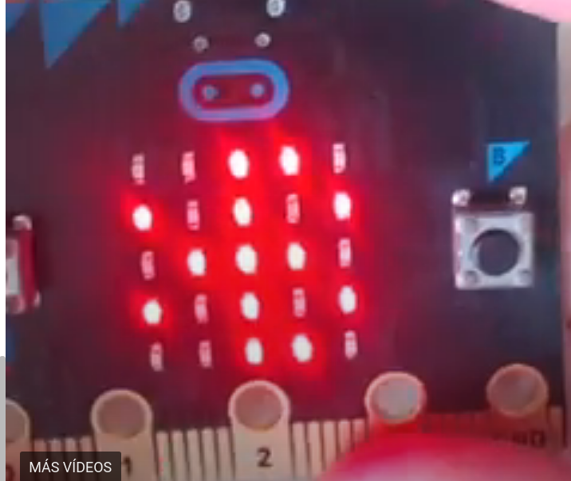

Ahora nos va a mostrar un patrón en los leds y un grupo de 4 letras que nos van a permitir indentificar cada micro:bit (el patrón y el nombre son diferentes en cada microbit). Reproduciremos ese patrón en la aplicación

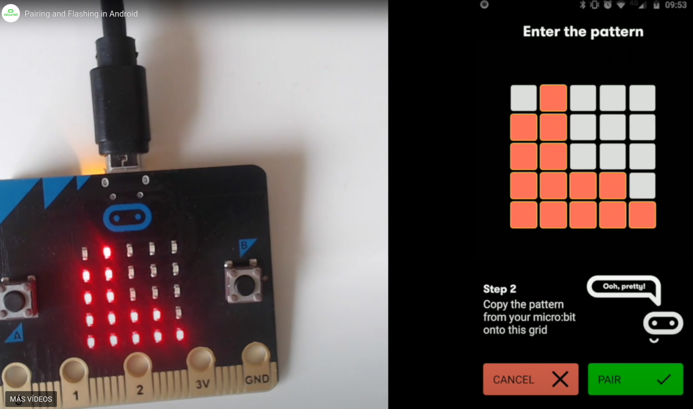

Si todo va bien ya tendremos emparejadas nuestra tableta y la micro:bit

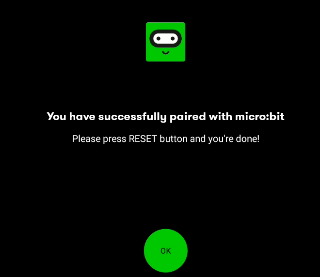

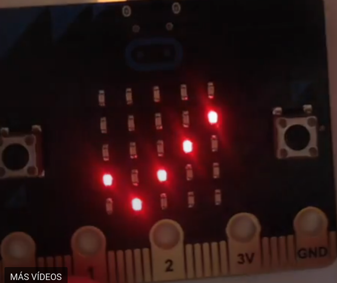

Ahora ya podemos enviar nuestro programa a micro:bit. Para ello pulsamos la opción Flash donde veremos los nombres de algunos programas de ejemplo y el que hemos descargado (de momento solo se pueden editar en la tableta usando el editor web de makeCode)

Seleccionamos el programa y pulsamos Flash

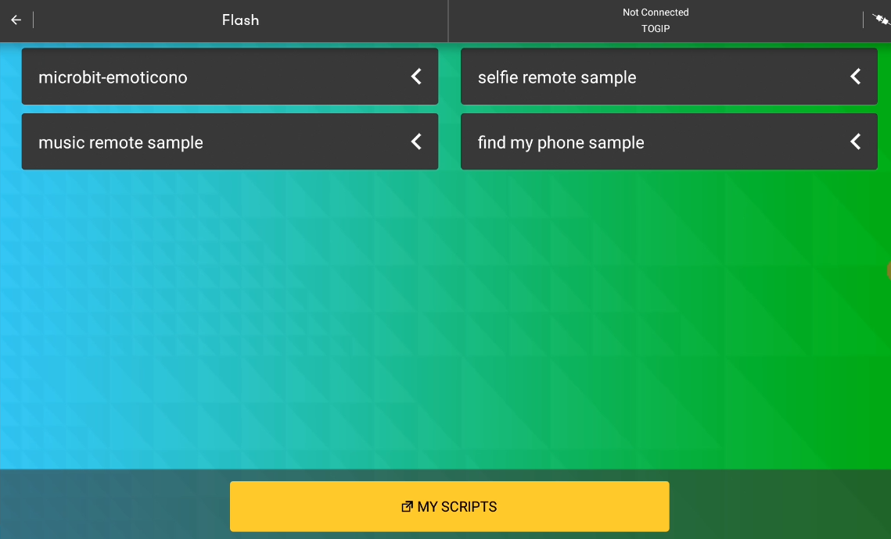

El proceso es algo lento pero suele terminar sin problema

Una vez emparejada podemos seleccionar la micro:bit desde una lista de todas las placas que ya hemos utilizado. 

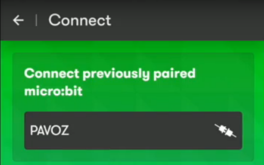

Sí vamos a trabajar con varias micro:bit conviene etiquetarlas con el código nombre que nos da al emparejarlas para así identificarlas fácilmente.

[Vídeo: Cómo programar la micro:bit desde una tableta Android vía Bluetooth](https://youtu.be/HNYG-hVMT8c)

## Resolución de problemas

* No entra en modo emparejamiento Bluetooth: Si tras pulsar los botones A+B y Reset y soltar el botón de Reset no entra en modo emparejamiento Bluetooth y no ves el logo de Bluetooth

* Si ves un comportamiento errático asegúrate que las pilas o batería están completamente cargadas.

* Si falla alguna de las etapas hay que volver a empezar.

## Referencias

[Guide to mobile & tablet apps](https://microbit.org/get-started/user-guide/mobile/)

