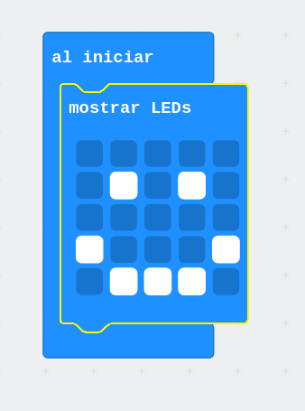
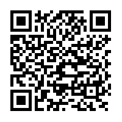
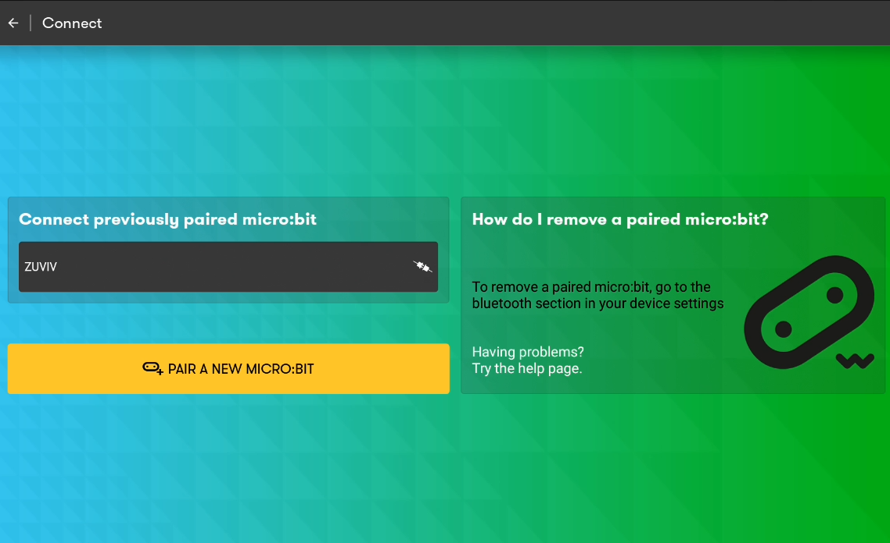
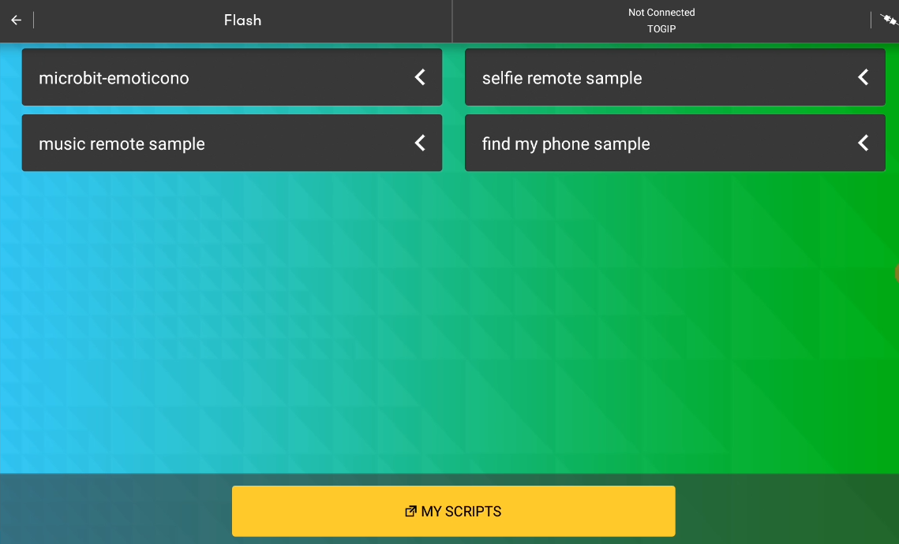

# Cómo programar la micro:bit desde una tableta Android (vía Bluetooth)

Vamos a ver cómo podemos programar la micro:bit desde una tableta Android y cómo transferir nuestro programa vía Bluetooth.

## Programamos con MakeCode

Usaremos el editor de bloques [MakeCode](https://makecode.microbit.org/) para crear un sencillo programa desde la tableta

Podemos empezar haciendo que nos muestre un emoji minimalista:

Damos nombre a nuestro programa

NombrPrograma.png

Una vez terminado descargamos el fichero hex, pulsando sobre el botón **"Descargar"**

(Escaneando este QR o desde el enlace se puede descargar el programa)

 [Programa](https://makecode.microbit.org/_XYw5sE3po5vU)

## App micro:bit

Ahora necesitamos la [app de micro:bit](https://play.google.com/store/apps/details?id=com.samsung.microbit) (creada por Sansumg) para transferir el fichero hex descargado a nuestra micro:bit

[app de micro:bit](https://play.google.com/store/apps/details?id=com.samsung.microbit) 

La instalamos y al abrirla seleccionamos la opción de conectar

Pulsamos en "Pair a new micro:bit"

Ahora pulsamos los botones A y B y el de reset, soltamos reset 

 la microbit debe entrar en el modo Bluetooth

[Vídeo: Cómo programar la micro:bit desde una tableta Android vía Bluetooth](https://youtu.be/HNYG-hVMT8c)

## Resolución de problemas

* No entra en modo emparejamiento Bluetooth: Si tras pulsar los botones A+B y Reset y soltar el botón de Reset no entra en modo emparejamiento Bluetooth y no ves el logo de Bluetooth

* Si ves un comportamiento errático asegúrate que las pilas o batería están completamente cargadas.

## Referencias

[Guide to mobile & tablet apps](https://microbit.org/get-started/user-guide/mobile/)