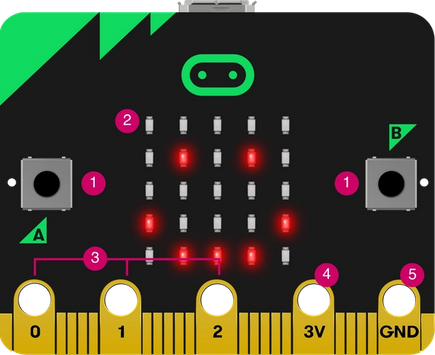
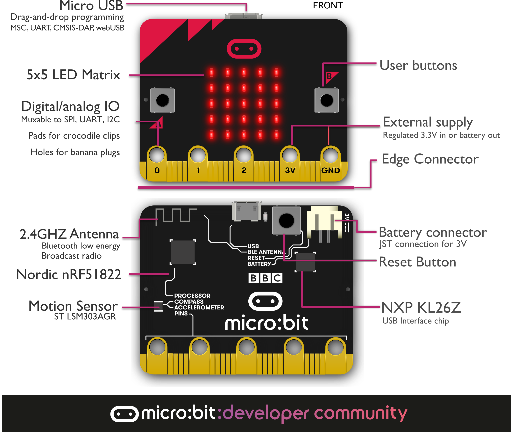

## ¿Qué es Microbit http://microbit.org?

micro:bit es una pequeña computadora programable, diseñada para hacer ¡fáciles y divertidos! enseñanza y aprendizaje.

Nos permite trabajar la computción física (haciendo tangible y "tocable") y el pensamiento computacional de una forma sencilla

Beneficiada de la experiencia de otros muchos sistemas similares anteriores (como Arduino o Raspberry pi) incluye en una pequeña tarjeta una gran cantidad de sensores, leds y botones, permitiendonos hacer una gran cantidad de proyectos distintos usando sólamente la tarjeta micro:bit

1. Botón A y Botón B
1. 5x5 leds rojos
1. Conectores para pinza de cocodrilo P0, P1, P2 (GPIO)
1. Conector 3V
1. Conector GND

1. Antena de radio y bluetooth
1. Procesador y sensor de temperatura
1. Brújula
1. Acelerómetro
1. Pines (GPIO)
1. Conector microUSB (alimentación y carga de programas)
1. Led de alimentación y/o programación
1. Botón reset
1. Conector de alimentación (2 x pilas 1.5V)
1. Chip USB

(Tomado de [Overview de microbit.org](https://microbit.org/get-started/user-guide/overview/))

## Programación

Podemos programarla usando bloques con MakeCode o Scratch

o con lenguajes de programación como Python, Javascript,  e incluso con el C de Arduino

Trabajar con Scratch permite mezclar parte de la funcionalidad de nuestra micro:bit (botones, leds, acelerómetro y conexión a los pines 0,1 y 2) con el resto de posibilidades de Scratch: personajes, sonidos, dibujar en pantalla, vídeo, música,...
Perdemos algunas de las características de micro:bit como la brújula y el sensor de temperatura pero ganamos en interacción.

Para usar toda la funcionalidad de micro:bit debemos usar el editor de bloques de MakeCode o python

Para hacerlo también podemos usar tanto ordenadores como tabletas.

## Python

[Referencia python](http://microbit.org/es/guide/python/)

[Introducción](http://microbit-micropython.readthedocs.io/en/latest/tutorials/introduction.html)

## Proceso de compilación

El proceso es escribimos un código en un fichero .py que se convertirá en un fichero .hex que podremos pasar a microbit

### Editor web online
Al pulsar descargar se descarga el fichero hex que copiaremos en el disco microbit

#### Editor

http://python.microbit.org/editor.html

http://python.microbit.org/v/1

#### Editor Mu

Editor sencillo escrito en python y disponible para Windows, OSX, Linux y  Raspberry Pi.  

[Descarga](https://codewith.mu/)

