## Scratch y micro:bit

Scratch 3.0 incluye una extensión para trabajar con micro:bit

Trabajar con Scratch permite mezclar parte de la funcionalidad de nuestra micro:bit (botones, leds, acelerómetro y conexión a los pines 0,1 y 2) con el resto de posibilidades de Scratch: personajes, sonidos, dibujar en pantalla, vídeo, música,...
Perdemos algunas de las características de micro:bit como la brújula y el sensor de temperatura pero ganamos en interacción.

Para usar toda la funcionalidad de micro:bit debemos usar el editor de bloques de MakeCode o python

## Instalación

* En tabletas Android, usando la [app de Scratch](https://play.google.com/store/apps/details?id=org.scratch)

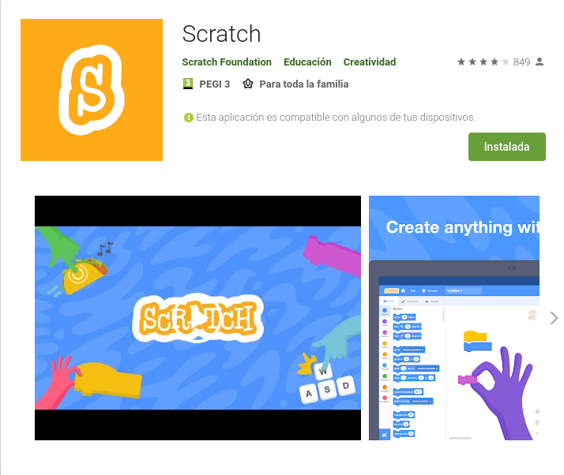

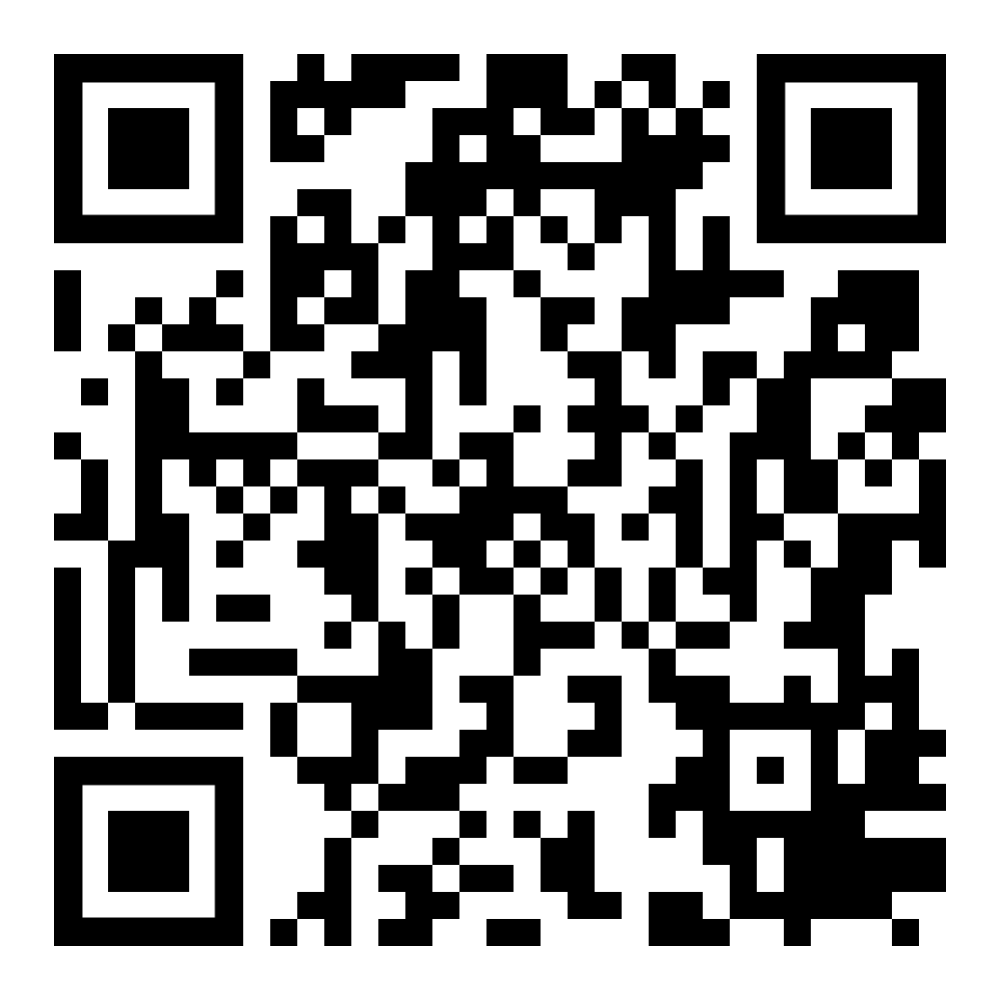

* En Windows instala [Scratch Link](https://downloads.scratch.mit.edu/link/windows.zip)

* En Mac instala su versión de [Scratch Link](https://downloads.scratch.mit.edu/link/mac.zip)

## Scratch y micro:bit

Para poder trabajar con Scratch y micro:bit necesitamos instalar en nuestra micro:bit un programa específico. Para ello necesitamos un PC

1. Descargamos el [firmware de Scratch](https://downloads.scratch.mit.edu/microbit/scratch-microbit-1.1.0.hex.zip)
1. Conectamos nuestra micro:bit con el cable USB al ordenadore (Puede ser windows, mac o linux)
1. Aparecerá una unidad disco (similar a pendrive) llamada **"Microbit"**
1. Descomprimimos el fichero zip
1. Copiamos el fichero hex a la unidad micro:bit

1. El led trasero, junto al conector usb de la micro:bit parpadea durante unos segundos.
1. Cuando quede fijo ha terminado el proceso. Ya podemos trabajar con ella.

Ahora vamos a ver como utilizarla desde Scratch:

1. Enciende tu micro:bit
1. Abre tu aplicación Scratch
1. Añade la extensión micro:bit
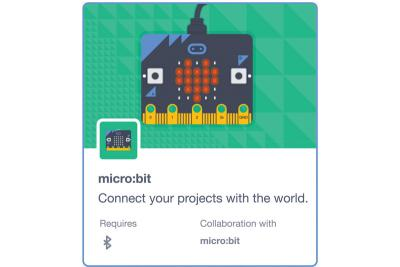
1. Empareja tu micro:bit
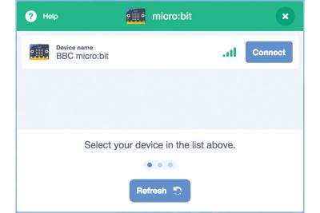
1. Ya puedes usar tus bloques de scratch y de micro:bit
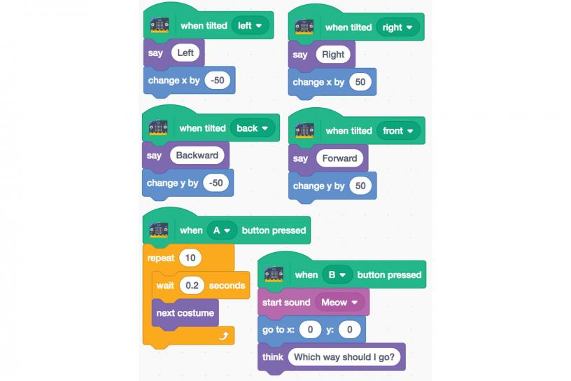

## Bloques de Scratch para micro:bit

Estos son los bloques que incluye la extensión de Scratch para micro:bit:
* Detección de pulsación de botones
* Detección de movimiento
* Mostrar textos, valores o dibujos en pantalla
* Detección de movimientos

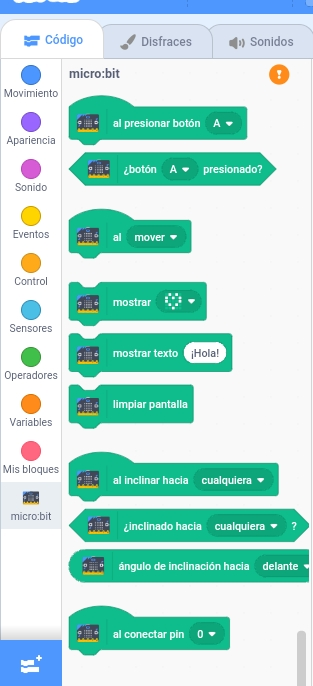

### Detectando la placa micro:bit

Al cargar la extensión se busca si existe alguna placa micro:bit cercana. 

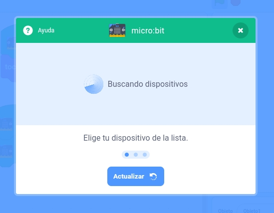

También se lanza este asistente si no hay ningna conectada y pulsamos sore la admiración naranja

## Ejemplos

Los ejemplos están incluídos en un [Studio de Scratch](https://scratch.mit.edu/studios/27053713/) y compartidos en la carpeta [Proyectos](./proyectos)
Podemos importarlos bien como un fichero sb3 descargado o desde google drive

### Interacción con los personajes
Ejemplo sencillo de interación donde nuestro Gato maúlla al pulsar el botón A de la micro:bit

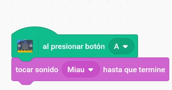

## Mostrar nuestros diseños

Al agitar se muestra un corazón o cualquier diseño que hayamos hecho con los leds

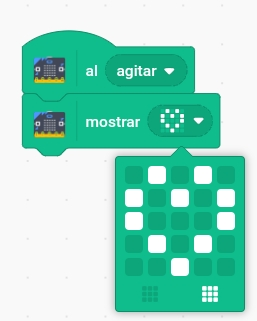

Podemos usarlos para mostrar nuestras emociones (a la vez que cambia el disfraz de nuesro personaje)

### Dado

Al agitar la micro:bit se muestra un valor aleatorio entre 1 y 6

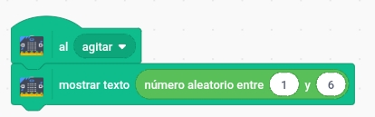

### Compartir proyectos 

Podemos compartir proyectos que abriremos por ejemplo desde google drive

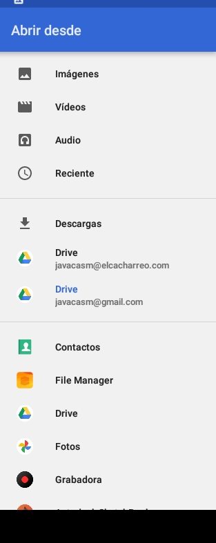

Los proyectos son compatibles entre plataformas: podemos crearlos en un PC y compartirlos en google drive a donde accederemos desde la tableta

### Uso del acelerómetro

Movemos nuestro personaje por pantalla inclinando la microbit en diferentes direcciones 

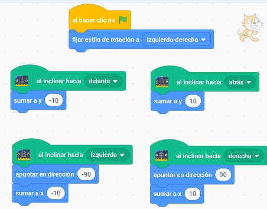

Se puede trabajar con más precisión usando el bloque que mide el número de grados de inclinación

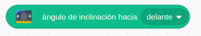

### Contador de saltos
Podemos usar las variables de Scratch para guardar el número de saltos que hemos datos, mostrando en la pantalla de led el valor (y en pantalla también)

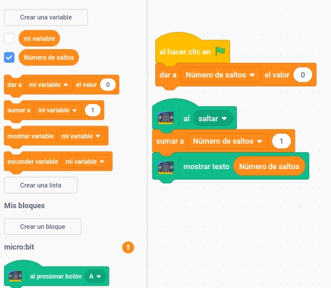

### Otras extensiones

También podemos usar varias extensiones como la vídeo al mismo tiempo. En este sencilo ejemplo activamos el vídeo al pulsar el botón A (se deja como ejercicio apagarlo al pulsar el botón B), al agitar la microbit se muestra un corazón y al saltar maúlla, moviéndose Gato al inclinarla a la derecha o izquierda

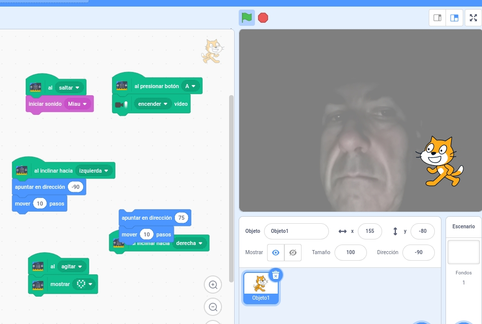

## Referencias y recursos

[Algunas imágenes del tutorial de Diyode Magazine](https://diyodemag.com/education/kids_coding_scratch_30_meets_micro_bit)

[Tutorial](https://scratch.mit.edu/microbit)

[Tarjetas scratch  y micro:bit](https://resources.scratch.mit.edu/www/cards/en/microbit-cards.pdf)
