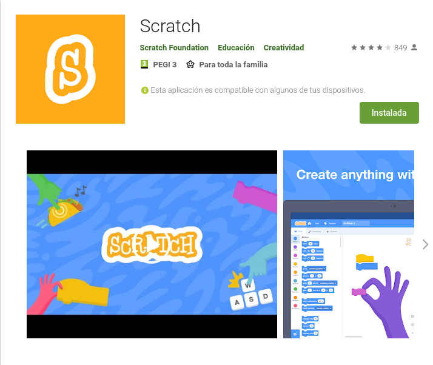

## Scratch y micro:bit

Scratch 3.0 incluye una extensión para trabajar con micro:bit

Trabajar con Scratch permite mezclar parte de la funcionalidad de nuestra micro:bit (botones, leds, acelerómetro y conexión a los pines 0,1 y 2) con el resto de posibilidades de Scratch: personajes, sonidos, dibujar en pantalla, vídeo, música,...
Perdemos algunas de las características de micro:bit como la brújula y el sensor de temperatura pero ganamos en interacción.

Para usar toda la funcionalidad de micro:bit debemos usar el editor de bloques de MakeCode o python

## Instalación

* En tabletas Android, usando la [app de Scratch](https://play.google.com/store/apps/details?id=org.scratch)

* En Windows instala [Scratch Link](https://downloads.scratch.mit.edu/link/windows.zip)

* En Mac instala su versión de [Scratch Link](https://downloads.scratch.mit.edu/link/mac.zip)

## Scratch y micro:bit

Para poder trabajar con Scratch y micro:bit necesitamos instalar en nuestra micro:bit un programa específico. Para ello necesitamos un PC

1. Descargamos el [firmware de Scratch](https://downloads.scratch.mit.edu/microbit/scratch-microbit-1.1.0.hex.zip)
1. Conectamos nuestra micro:bit con el cable USB al ordenadore (Puede ser windows, mac o linux)
1. Aparecerá una unidad disco (similar a pendrive) llamada **"Microbit"**
1. Descomprimimos el fichero zip
1. Copiamos el fichero hex a la unidad micro:bit

1. El led trasero, junto al conector usb de la micro:bit parpadea durante unos segundos.
1. Cuando quede fijo ha terminado el proceso. Ya podemos trabajar con ella.
1. Aparecerán en los leds 4 caracteres que son un nombre aleatorio que se le da a la micro:bit y que nos servirá para identicar cada una de ellas. Si tenemos varias, no es mala idea etiquetarlas para así distinguirlas.